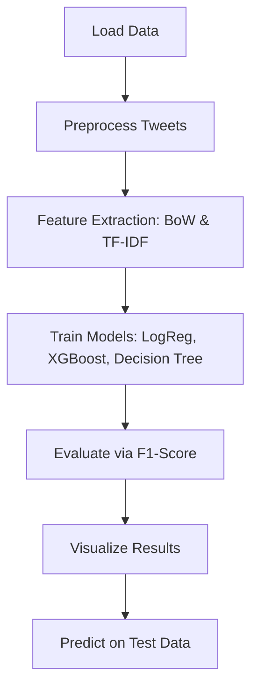

<div align="center">
   
   <strong>Twitter Sentiment Analysis Project</strong>
   
</div>
<div align="center">


</div>

A modular machine learning pipeline for classifying tweet sentiments as **positive** or **negative**, using robust text preprocessing, feature engineering, and model comparison. This project demonstrates practical NLP techniques and evaluates multiple classifiers to identify the most effective model for real-world sentiment prediction.

---

## 🧠 Objectives

- Clean and preprocess raw Twitter data for sentiment classification.
- Extract meaningful features using **Bag-of-Words (BoW)** and **TF-IDF**.
- Train and evaluate multiple ML models to identify the best performer.
- Visualize insights from the data (hashtags, word clouds).
- Generate predictions on unseen test data using the top-performing model.

---

## ⚙️ Workflow Overview



---

## 📦 Requirements

Install dependencies using:

```bash
pip install -r requirements.txt
```

Also download NLTK tokenizer:

```python
import nltk
nltk.download('punkt')
```

### `requirements.txt` includes:

- `pandas`
- `numpy`
- `nltk`
- `scikit-learn`
- `xgboost`
- `matplotlib`
- `seaborn`
- `wordcloud`

---

## 🚀 How to Run

1. Clone this repository:
   ```bash
   git clone https://github.com/SatChittAnand/Twitter-Sentiment-Analysis.git
   cd Twitter-Sentiment-Analysis
   ```

2. Place the datasets `train_SentimentAnalysis.csv` and `test_SentimentAnalysis.csv` in the root directory.

3. Run the script:
   ```bash
   python sentimentanalysistwitter.py
   ```

The script will:
- Preprocess and vectorize the data
- Train and evaluate models
- Generate visualizations
- Save predictions to `predictions.csv`

---

## 🤖 Models Implemented

|        Model       | Feature Technique | Evaluation Metric |
|--------------------|-------------------|-------------------|
| Logistic Regression| BoW, TF-IDF       | F1-Score          |
| XGBoost Classifier | BoW, TF-IDF       | F1-Score          |
| Decision Tree      | BoW, TF-IDF       | F1-Score          |

---

## 📊 Results

- **Logistic Regression with TF-IDF** achieved the highest F1-score.
- Visual comparisons via point plots highlight model-feature performance trade-offs.
- Word clouds and hashtag frequency plots offer intuitive insights into tweet content.

---

## 📁 Project Structure

```
twitter-sentiment-analysis/
│
├── sentimentanalysistwitter.py       # Main script
├── train_SentimentAnalysis.csv       # Training dataset
├── test_SentimentAnalysis.csv        # Test dataset
├── predictions.csv                   # Output predictions
├── requirements.txt                  # Dependencies
└── README.md                         # Project documentation
```

---

## 🌟 Highlights

- ✅ Modular design for easy extension
- 📈 Visual insights into tweet content and trends
- 🔁 Reproducible and scalable for larger datasets
- 🧩 Easy to integrate into real-time sentiment monitoring systems

---

## 🤝 Contributing

Pull requests are welcome! For major changes, please open an issue first to discuss what you’d like to modify.

---

## 📜 License

This project is licensed under the MIT License.

---

## 🙌 Acknowledgments

- [NLTK](https://www.nltk.org/)
- [Scikit-learn](https://scikit-learn.org/)
- [XGBoost](https://xgboost.readthedocs.io/)
- [Seaborn](https://seaborn.pydata.org/)
- [WordCloud](https://amueller.github.io/word_cloud/)

---
